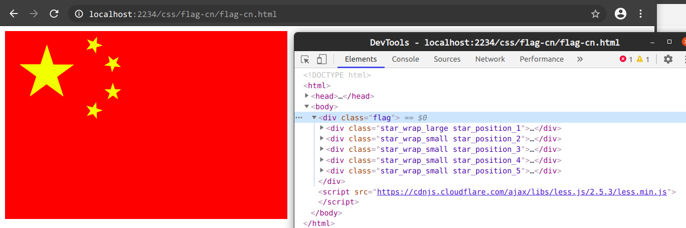

# 简介

使用 less 画五星红旗

# 开始

1、 下载 flag-cn.html flag-cn.less 到本地文件夹

2、 因为 浏览器 CORS，所以需配置 nginx 代理步骤1的本地文件夹

3、 查看结果

4、 可修改 flag-cn.less 的 @flag_height 来改变国旗大小，改得太小的会导致右上角的五角星超出背景

# 原理

## 五角星画法

1、 画 五个重叠的 等腰三角形，三角形内角分别为 36° 72° 72°，小角朝上，短边为底，三角形高 ： （底 / 2） = tan72°

2、 以 三角形底部中心 为旋转中心，按 72° 144° -72° -144° 旋转其余 四个 三角形

## 五角星定位

1、 按 [百度百科](https://baike.baidu.com/item/%E4%B8%AD%E5%8D%8E%E4%BA%BA%E6%B0%91%E5%85%B1%E5%92%8C%E5%9B%BD%E5%9B%BD%E6%97%97/240342) 国旗墨线图 为参考，确定 五角星大小 及 定位

2、 国旗墨线图 如下

